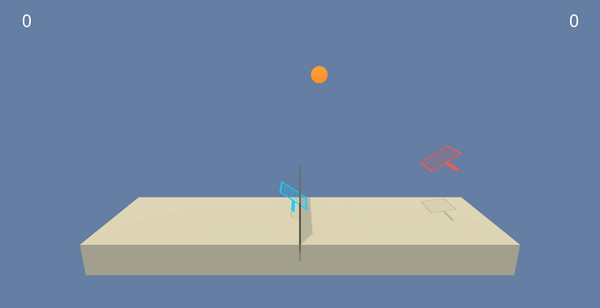

# DRL-multi-agents
Continous control of multiple agents.

Trained agent  

### Introduction  

In this environment, two agents control rackets to bounce a ball over a net. If an agent hits the ball over the net, it receives a reward of +0.1. If an agent lets a ball hit the ground or hits the ball out of bounds, it receives a reward of -0.01. Thus, the goal of each agent is to keep the ball in play.

The observation space consists of 8 variables corresponding to the position and velocity of the ball and racket. Each agent receives its own, local observation. Two continuous actions are available, corresponding to movement toward (or away from) the net, and jumping.

The task is episodic, and in order to solve the environment, your agents must get an average score of +0.5 (over 100 consecutive episodes, after taking the maximum over both agents). Specifically,  
*After each episode, we add up the rewards that each agent received (without discounting), to get a score for each agent.
*This yields 2 (potentially different) scores. We then take the maximum of these 2 scores.  
This yields a single score for each episode.  

The environment is considered solved, when the average (over 100 episodes) of those scores is at least +0.5.

### Dependencies (OS: Ubuntu 18.04)  

Install Anaconda - https://docs.conda.io/projects/conda/en/latest/user-guide/install/linux.html  
Run install.sh file to add required components.

Clone the repository, in conda 'drlnd' environment start jupyter notebook by typing in terminal `jupyter-notebook`, switch kernel to 'drlnd'.

Download built environment - https://s3-us-west-1.amazonaws.com/udacity-drlnd/P3/Tennis/Tennis_Linux.zip

### Training the agent
To train the agent use Tennis.ipynb file  
Type in terminal:  
	jupyter-notebook Tennis.ipnyb

To visualise use TennisVisualisation.ipnyb
