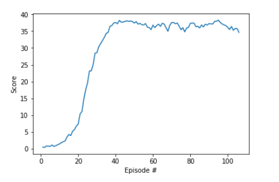

#Report

Actor-critic methods are at the intersection of policy-based methods such as reinforce and value-based methods such as DQN. If a deep neural network is used to approximate a value function, the deep reinforcement learning agent is said to be value-based. If the network is used to approximate a policy, the agent is said to be policy-based. 

A value function can be used as a baseline (training target) for a policy-based agent to reduce it's variance.

The Monte-Carlo esimate consists of rolling out an episode in calculating the discounted total reward from the reward sequence. After every episode the network is updated. The more estimates are provided the better the value function will be. Monte-Carlo methods will have high variance because estimates for a state can vary greatly across episodes. The reason for high variance is compounding lots of random events that happened during the course of a single episode. But the methods are unbiased as there is no recursive, local estimation of a state during the learning proceess. So given much enugh data, the estimate shall be accurate.

The temporal difference method relies on estimating the value of the current state using a single reward sample. Agent calculates current value function basing on the value of the current state and the value of the next state. So it basically optimizes the action basing on possible outcomes of the nest states(?). TD methods have low variance because at a single learning step one step of an actor is compunded. There is not much randomness but bootstrapping on the next state estimates adds bias into calculation. The agent will learn faster than in Monte-Carlo methods, will have lower variance, but will have higher bias.
The temporal difference method have lower variance because at every time step the actor
'judges' what the finall score of the whole episode will be. So the further the episode goes the higher the probability of proper guessing (estimating) is as agent has more data about it's current state.

By using a TD critic instead of a Monte-Carlo baseline, the variance of policy-based methods is reduced.

DDPG is a differen kind of actor-critic method. It could be seen as approximate DQN, insted of an actual actor critic. The reason is that the critic in DDPG is uded to approximate over the Q values of the next state insted of being a learning baseline.

The DDPG network architecture is a a bit altered in comparison to classical Actor-Critic.
Actor takes states as inputs and returns actions as outputs.
Critic takes as inputs current states and actions values. It further returns as an output single Q value which is basically Q value of that state with that particular action. The returnet value expresses how good chosen actions are in that particular state. Therefore it is possible to compare two action sets.

The learning process of the Critic is the same as in DQN.
The learning process of the Actor is based on deterministic policy gradient theorem. The intuition behind the process is as follows:
1. The Actor takes an action in a particular state,
2. The action is evaluated by the Critic,
3. The Actor takes slightly different action,
4. The Critic evaluates the action,
5. Comparison of evaluated Q values shows the direction in which action shall be changed to get better results

In the beggining the Critic shall learn faster than the Actor to provide appropriate Q values for the Actor.

Main weakness of the DDPG algorithm is that it is fragile in a sense of poor initial convergence. Also it requiers lots of hyperparameters tunning to actually achieve proper convergence.

Eploration in the case of DDPG is provided by Actor's weights perturbation.

The main idea of Proximal Policy Optimization is to use soft constraints around learning policy.

###Model architecture

*Actor: Hidden(state_size, 256)-ReLU, Hidden(256, 128)-ReLU, Output(128, action_size)-TanH
*Critic: Hidden(state_size, 256)-ReLU, Hidden(256 + action_size, 128)-ReLU, Output(128, 1)-Linear

###Hyperparameters

BUFFER_SIZE = 1e5  - size of the replay buffer  
BATCH_SIZE = 128  - number of samples used during learning step  
TAU = 1e-3  - local parameters to target update factor  
LR_ACTOR = 1e-4 - learning rate of the actor 
LR_CRITIC = 1e-4 - learning rate of the critic
WEIGHT_DECAY = 0  - rate of weight decay
GAMMA = 0.99 - discount factor

###Plot of rewards 

The environment has been solved (mean score(over 100 episodes, and over all 20 agents was higher than 30) in around 105 episodes.  
  

Actor's weights are stored in 'checkpoint_actor.pth'
Critic's weights are stored in 'checkpoint_actor.pth'  

###Future improvement

Main weakness of the DDPG algorithm is that it is fragile in a sense of poor initial convergence. Also it requiers lots of hyperparameters tunning to actually achieve proper convergence. Finding optimal set of hyperparameters could improve that factor considerably.